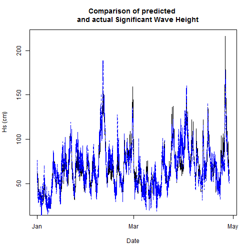

Surf Zone Predictor:  
========================================================
author: dwake95
date: 23 August 2015

**Overview:** The Surf Zone Predictor app utilizes data from the Coastal Data Information Program (CDIP) at Scripps Institute of Oceanography (SIO), and creates a regression model which compares the parameters of waves at a deep water wave buoy with those at the SIO Pier, which is just outside of the surf zone.  The model is then used to predict output of expected variables to predict future surf zone conditions.

CDIP Data Extraction
========================================================

This app is using data from stations 100 and 73.  

***
A graph of the data from CDIP for the Torrey Pines buoy (100) with the Scripps Pier (73) data overlayed in Red:  


Accessing Data and Creating the Model
========================================================
SIO provides a mechanism called *justdar* in order to access data.  A description of this data is available at this [link] (http://cdip.ucsd.edu/data_access/justdar.cdip?h)

The model used predictor variables from station 100:
+ Significant Wave Height (Hs)
+ Dominant Wave Period (Tp)
+ Dominant Wave Direction (Dp)  

to predict Hs from station 73 using an generalized linear regression (glm) model 


The training data for the model utilizes data from prior years, from 20120101 to 20141231. 


Model
========================================================
The results of the model are shown below:  


```

Call:  NULL

Coefficients:
(Intercept)           Hs           Tp           Dp  
   -68.8976       0.7943       0.9316       0.2152  

Degrees of Freedom: 34912 Total (i.e. Null);  34909 Residual
Null Deviance:	    42840000 
Residual Deviance: 5363000 	AIC: 274900
```

Next test data was utilized from 2015 in order to test the model.


Test Set Prediction
========================================================

 

The average error of the model on the test data is 10.89 cm.
